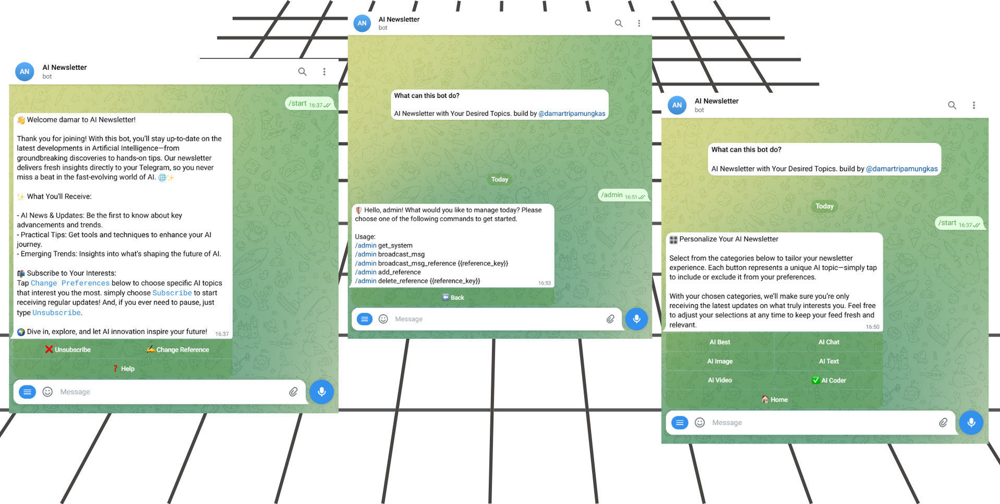

<h1 align="center">
    TELEGRAM-BOT-NEWSLETTER
</h1>

  
  
  
  

 

 

<h2> ⚙️ Functionality </h2>

- **Friendly customization of message** you can edit directly in file markdown on folder `script`
- **Easy change reference** user can change reference just click button on section `Change Reference`
- **Powerfull broadcast admin** admin can broadcast message to all user with text, file or media
- **Awesome admin section** admin can add, delete reference, see statistics user, blocking user
- **Plug and play** you can running this script very easy just plug and play dont confused setting database or anything because this script will automaticly setup for you

<h2> 📖 How to get script </h2>

You can buy this script just contact me, i provide several versions, each version has a different price:

- compile sources
- open source

I am also open to collaborating.

<h2> 🔨 Tech stack </h2>

- TypeScript
- Node.js
- NoSQL

### 💻 Demo

https://t.me

### 💬 Contact

please feel free to reach out to me via Telegram: https://t.me/damartripamungkas. I'm here to help bring your vision to life!
